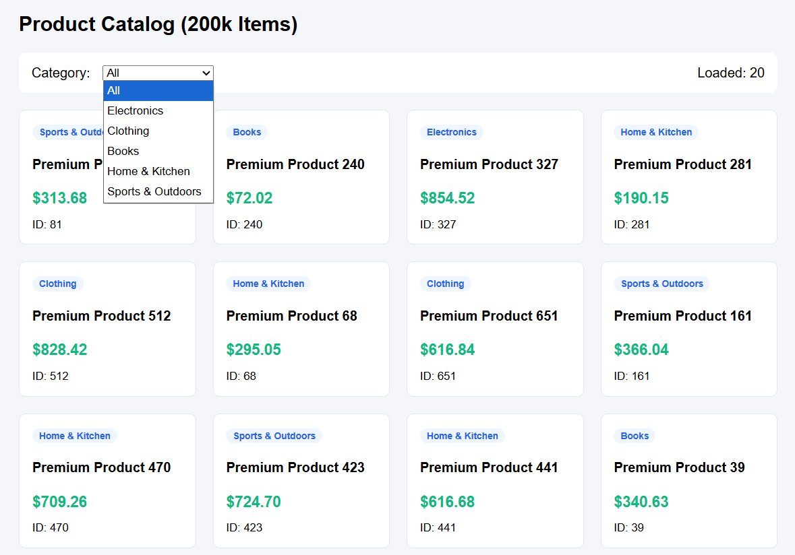

# Product Browser API

A backend project built for the CodeVector internship take-home task. This API allows users to browse around 200,000 products, filter products by category, and paginate through results efficiently using cursor-based pagination.

## Live Demo

Live URL: https://product-browser-api.onrender.com

## GitHub Repository

GitHub Repo: https://github.com/shipra830/product-browser-api

## Project Screenshot

## Tech Stack

* Node.js
* Express.js
* PostgreSQL
* Neon Database
* Render
* HTML, CSS, JavaScript for simple UI

## Features

* Browse 200,000 products
* Newest-first product listing
* Category-based filtering
* Fast cursor-based pagination
* Stable pagination while data is changing
* Batch seed script for generating products
* PostgreSQL indexes for better query performance
* Simple frontend UI to test product browsing

## API Endpoint

### Get Products

GET /api/products

### Query Parameters

| Parameter | Required | Description                                                            |
| --------- | -------- | ---------------------------------------------------------------------- |
| limit     | No       | Number of products to return. Default is 20. Maximum is capped at 100. |
| category  | No       | Filter products by category.                                           |
| cursor    | No       | Cursor returned from the previous response for loading the next page.  |

## Example Requests

/api/products?limit=20

/api/products?limit=20&category=Electronics

/api/products?limit=20&category=Books&cursor=cursor_value_here

## Example Response

{
"success": true,
"count": 20,
"nextCursor": "2026-06-23T10:20:30.000Z_150_2026-06-23T12:00:00.000Z",
"products": [
{
"id": 150,
"name": "Premium Product 150",
"category": "Electronics",
"price": "299.99",
"created_at": "2026-06-23T10:00:00.000Z",
"updated_at": "2026-06-23T10:20:30.000Z"
}
]
}

## Pagination Strategy

I used cursor-based pagination instead of offset-based pagination.

Offset-based pagination can become slow on large datasets because the database has to skip many rows before returning the requested results. It can also become inconsistent when new products are inserted or existing products are updated while a user is browsing.

The API sorts products by:

updated_at DESC, id DESC

The cursor contains:

* The last product's updated_at
* The last product's id
* A stable snapshotTime

When the first page is requested, the API creates a snapshot timestamp. All next pages use the same snapshot timestamp. This means newly added or updated products do not change the current browsing order, which helps prevent duplicate or missed products during pagination.

## Database Indexes

The following indexes are used for better query performance:

CREATE INDEX idx_products_updated_id
ON products (updated_at DESC, id DESC);

CREATE INDEX idx_products_category_updated_id
ON products (category, updated_at DESC, id DESC);

These indexes help the database quickly return newest-first products and category-filtered results.

## Seeding

The database is populated with 200,000 products using a seed script.

The seed script inserts products in batches instead of inserting one product at a time. This makes the seeding process faster and more suitable for a larger dataset.

Run seed:

npm run seed

## Run Locally

Install dependencies:

npm install

Create a .env file:

DATABASE_URL=your_postgresql_database_url
PORT=3000

Start the server:

npm start

For development:

npm run dev

Open in browser:

http://localhost:3000

Test API:

http://localhost:3000/api/products?limit=20

## Project Structure

product-browser-api/
│
├── screenshots/
│   └── product-browser-api.png
├── index.html
├── server.js
├── seed.js
├── schema.sql
├── package.json
├── package-lock.json
├── README.md
└── .gitignore

Note: The .env file is not included in the repository for security reasons.

## What I Chose and Why

I chose Node.js with Express.js because it is simple, fast to build with, and suitable for creating REST APIs. I used PostgreSQL with Neon because PostgreSQL supports efficient indexing, sorting, filtering, and reliable pagination on large datasets.

For pagination, I chose cursor-based pagination because it performs better than offset-based pagination on large datasets and gives more consistent results when data is changing.

## What I Would Improve With More Time

With more time, I would add:

* Automated tests for pagination and filtering
* Search by product name
* Better API documentation
* More detailed error handling
* Query performance benchmarking
* Monitoring and logging
* A production-ready bulk insert method using PostgreSQL COPY

## How I Used AI

I used AI to understand the best pagination approach for changing data and to improve the backend structure. AI helped with code review, README drafting, and identifying why offset-based pagination is not ideal for this task.

I reviewed the generated suggestions myself and made sure I understood the cursor-based pagination logic, especially the use of updated_at, id, and snapshotTime.
